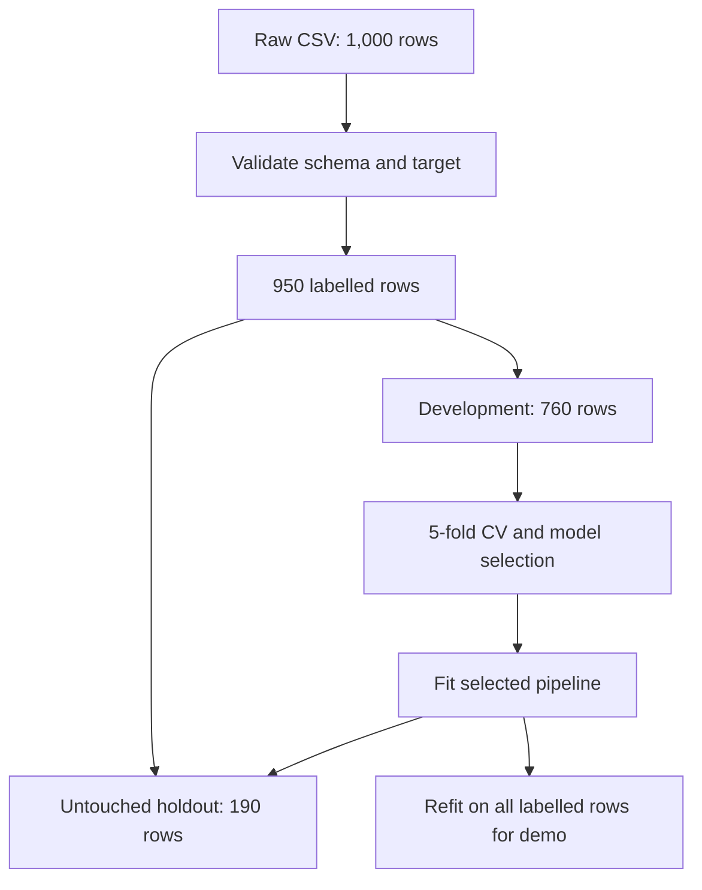

# CreditWise — Responsible Loan Approval Prediction

[](https://www.python.org/)
[](https://scikit-learn.org/)
[](https://streamlit.io/)
[](https://github.com/vivekkr-data/CreditWise-Loan-System/actions/workflows/tests.yml)
[](LICENSE)
[](https://creditwise-loan-system-vivek.streamlit.app/)

CreditWise is an end-to-end machine-learning portfolio project that estimates whether a loan application resembles previously approved applications. It combines validated data loading, leakage-safe preprocessing, responsible feature selection, an untouched final holdout, development-only model comparison, automated tests, continuous integration, subgroup diagnostics, and a deployed Streamlit interface.

**Live application:** [creditwise-loan-system-vivek.streamlit.app](https://creditwise-loan-system-vivek.streamlit.app/)

> CreditWise is an educational decision-support demonstration. Its model score is not a guaranteed probability and must not be used for real lending decisions without external validation, calibration, legal review, fairness assessment, security controls, and human oversight.

## 1. Results at a glance

The CSV contains 1,000 applications. Fifty records have no target label, leaving 950 labelled rows for modelling. A fixed stratified split reserves 190 rows as the final holdout and uses the other 760 rows for model selection and five-fold cross-validation.

| Evaluation | Rows | Accuracy | Precision | Recall | F1 | ROC-AUC |
|---|---:|---:|---:|---:|---:|---:|
| Final untouched holdout | 190 | **96.32%** | 90.77% | 98.33% | 94.40% | 98.71% |
| Development-only 5-fold CV mean | 760 | **96.84%** | 91.86% | 98.72% | 95.15% | 98.62% |
| Development-only CV standard deviation | 760 | 1.34% | 2.95% | 1.70% | 2.06% | 0.61% |

Positive class: `Loan_Approved = Yes`.

Final holdout confusion matrix:

|  | Predicted rejected | Predicted approved |
|---|---:|---:|
| Actually rejected | 124 | 6 |
| Actually approved | 1 | 59 |

The model classified **183 of 190 holdout applications correctly**. These figures are stored in [`reports/metrics.json`](reports/metrics.json) and regenerated by `train_model.py`.

## 2. Problem statement and scope

The supplied case study describes a bank loan-screening process where manual review may be slow or inconsistent. CreditWise demonstrates how historical tabular data can support a reviewer while keeping the final decision with a human.

The project focuses on two modelling mistakes:

1. Rejecting an otherwise suitable applicant.
2. Approving an applicant whose profile resembles previously rejected cases.

It reports precision, recall, F1, ROC-AUC, and the confusion matrix because accuracy alone can hide these different errors.

## 3. Dataset and feature policy

| Category | Columns used by the model |
|---|---|
| Income and assets | `Applicant_Income`, `Coapplicant_Income`, `Savings`, `Collateral_Value` |
| Credit and debt | `Credit_Score`, `Existing_Loans`, `DTI_Ratio` |
| Loan details | `Loan_Amount`, `Loan_Term`, `Loan_Purpose` |
| Applicant context | `Dependents`, `Employment_Status`, `Education_Level`, `Property_Area`, `Employer_Category` |

The following columns are retained only for identification, analysis, or fairness auditing and are **not model inputs**:

- `Applicant_ID`: identifier only.
- `Age`: sensitive lending attribute; removing it caused no holdout-performance loss.
- `Gender`: audit attribute only.
- `Marital_Status`: audit attribute only.

The application derives category choices and numeric guardrails from the bundled dataset. This avoids category mismatches and blocks unsupported out-of-distribution inputs. The supplied `Dataset Description.png` is preserved as an original case-study asset; where its example labels differ, the CSV is treated as the source of truth.

## 4. Evaluation methodology



Candidate models never use the 190-row final holdout during selection. Imputation, scaling, and encoding are contained inside the scikit-learn `Pipeline`, so every transformer is fitted only on the current training fold.

## 5. Model design and comparison

### Leakage-safe preprocessing

- Missing numeric values: median imputation.
- Missing categorical values: most-frequent imputation.
- Numeric features: standard scaling.
- Categorical features: one-hot encoding with unknown-category handling.
- Missing target labels: rows are removed; labels are never imputed.
- Evaluation split: stratified 80/20 with `random_state=42`.

### Selected classifier

```python
GradientBoostingClassifier(
    n_estimators=150,
    learning_rate=0.05,
    max_depth=2,
    random_state=42,
)
```

All candidate results below come only from five-fold cross-validation on the 760-row development set.

| Model | CV Accuracy | CV Precision | CV Recall | CV F1 | CV ROC-AUC |
|---|---:|---:|---:|---:|---:|
| **Gradient Boosting** | **96.84%** | **91.86%** | **98.72%** | **95.15%** | **98.62%** |
| Random Forest | 95.13% | 90.04% | 94.95% | 92.42% | 98.08% |
| Logistic Regression | 86.05% | 80.78% | 73.55% | 76.76% | 92.16% |

Reproduce the comparison with:

```bash
python benchmark_models.py
```

The benchmark uses one worker by default for reliable execution on laptops and constrained cloud containers. Parallel execution is optional, for example `CREDITWISE_N_JOBS=4 python benchmark_models.py` on Linux/macOS.

## 6. Responsible-ML safeguards

- Age, gender, marital status, and applicant ID are excluded from prediction.
- The UI collects only fields actually used by the model.
- Numeric inputs are limited to ranges observed during training.
- The UI says **model approval score**, not calibrated approval probability.
- A 50% threshold is clearly labelled as a demonstration choice.
- Feature importance is described as model behaviour, not causality.
- The app states that human, legal, policy, and fairness review remain necessary.

### Holdout subgroup diagnostic

`fairness_audit.py` measures holdout behaviour by gender without feeding gender into the model.

| Audit group | Rows | Actual approval rate | Predicted approval rate | Accuracy | False-positive rate | False-negative rate |
|---|---:|---:|---:|---:|---:|---:|
| Female | 71 | 32.39% | 33.80% | 98.59% | 2.08% | 0.00% |
| Male | 110 | 30.91% | 34.55% | 94.55% | 6.58% | 2.94% |

Nine holdout records have missing gender values and are not included in this table. These subgroups are small, so the figures are diagnostics—not proof of fairness. A real system needs larger representative samples, intersectional analysis, uncertainty intervals, policy-approved metrics, and ongoing monitoring. The reproducible output is stored in [`reports/fairness_audit.csv`](reports/fairness_audit.csv).

## 7. Repository structure

```text
CreditWise-Loan-System/
├── .github/workflows/tests.yml      # Tests, lint, scripts, notebook, report drift
├── .streamlit/config.toml           # Streamlit theme and server settings
├── reports/
│   ├── metrics.json                 # Holdout and development-CV metrics
│   ├── model_comparison.csv         # Development-only candidate comparison
│   └── fairness_audit.csv           # Holdout subgroup diagnostic
├── src/
│   ├── __init__.py
│   └── model.py                     # Validation, pipeline, evaluation, guardrails
├── tests/
│   ├── test_app.py                  # Streamlit startup and scoring smoke test
│   └── test_model.py                # Data, pipeline, metrics and guardrail tests
├── app.py                           # Streamlit decision-support interface
├── benchmark_models.py              # Reliable development-only model comparison
├── fairness_audit.py                # Responsible-ML subgroup report
├── train_model.py                   # Evaluation and local model-artifact command
├── credit_wise.ipynb                # Executable EDA and evaluation notebook
├── loan_approval_data.csv           # Bundled dataset
├── requirements.txt                 # Pinned deployment dependencies
├── requirements-dev.txt             # Pinned notebook, test and lint dependencies
├── *.png                            # Original brief and EDA images
├── LICENSE
└── README.md
```

## 8. Run locally

### Step 1: clone the repository

```bash
git clone https://github.com/vivekkr-data/CreditWise-Loan-System.git
cd CreditWise-Loan-System
```

### Step 2: create a virtual environment

Windows PowerShell:

```powershell
python -m venv .venv
.\.venv\Scripts\Activate.ps1
```

Linux or macOS:

```bash
python3 -m venv .venv
source .venv/bin/activate
```

### Step 3: install deployment dependencies

```bash
python -m pip install --upgrade pip
pip install -r requirements.txt
```

### Step 4: start the app

```bash
streamlit run app.py
```

Open the local URL shown by Streamlit, normally `http://localhost:8501`.

## 9. Reproduce and verify

Install the development dependencies:

```bash
pip install -r requirements-dev.txt
```

Run every verification command:

```bash
ruff check .
pip-audit -r requirements.txt
python -m unittest discover -s tests -v
python train_model.py
python benchmark_models.py
python fairness_audit.py
jupyter notebook credit_wise.ipynb
```

`train_model.py` also writes `artifacts/creditwise_pipeline.joblib`. Generated binary artifacts are ignored by Git. The deployed app trains the same small pipeline once and caches it in memory.

Direct runtime and development dependencies are pinned to the versions used to generate the committed reports. GitHub Actions runs linting and a deployment-dependency vulnerability audit, then executes tests, training, benchmarking, fairness reporting, and the notebook. CI fails if regenerated report files differ from the committed results.

## 10. Live deployment

### Streamlit Community Cloud

The production demo is deployed on Streamlit Community Cloud because the interface is built with Streamlit and requires no database or application secret.

**Live application:** [creditwise-loan-system-vivek.streamlit.app](https://creditwise-loan-system-vivek.streamlit.app/)

Deployment configuration:

1. Sign in to [Streamlit Community Cloud](https://share.streamlit.io/) with GitHub.
2. Create an app from `vivekkr-data/CreditWise-Loan-System`.
3. Select branch `main`.
4. Set the entrypoint to `app.py`.
5. Choose Python 3.12 or newer. The pinned NumPy version requires Python 3.12+.
6. Deploy.

A push to the connected `main` branch automatically updates the deployed application. On the free tier, the app may sleep after inactivity and can take a short time to wake up.

## 11. Limitations and next steps

- Only 950 labelled records are available.
- The data-collection process and population are undocumented.
- Validation is internal; there is no external, geographic, or time-based test set.
- The score is not probability-calibrated.
- The 50% threshold is a demonstration setting, not a business-policy decision.
- The fairness table uses small groups and one audit attribute.
- Feature importance does not provide causal or adverse-action explanations.
- The app has no authentication, database, audit log, or bank integration.

Before any real-world use, the next steps would include representative external data, probability calibration, threshold selection based on reviewed costs, stronger explainability, security controls, consent, audit logging, drift monitoring, formal fairness review, regulatory assessment, and a human appeal process.

## Author

**Vivek Kumar** — Computer Science student

- [GitHub](https://github.com/vivekkr-data)
- [LinkedIn](https://www.linkedin.com/in/vivek-kumar-66041b410)

## License

This project is available under the [MIT License](LICENSE).
