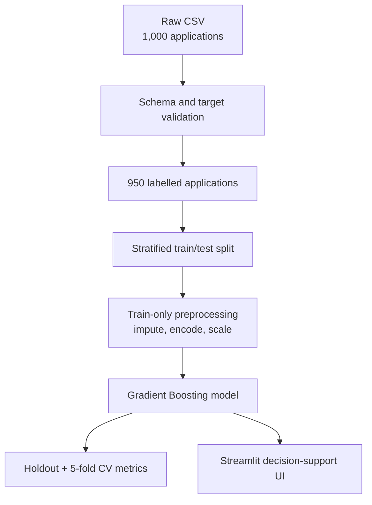

# CreditWise — Loan Approval Prediction System

[](https://www.python.org/)
[](https://scikit-learn.org/)
[](https://streamlit.io/)
[](https://github.com/vivekkr-data/CreditWise-Loan-System/actions/workflows/tests.yml)
[](LICENSE)
[](https://creditwise-loan-system-vivek.streamlit.app/)

CreditWise is an end-to-end machine-learning portfolio project that estimates the likelihood of a loan application being approved. It includes data validation, exploratory analysis, a leakage-safe scikit-learn pipeline, reproducible evaluation, automated tests, and a Streamlit interface.

**Live application:** [creditwise-loan-system-vivek.streamlit.app](https://creditwise-loan-system-vivek.streamlit.app/)

> This is a decision-support demonstration built from the dataset included in this repository. It is not a production lending system and must not be used to make real financial decisions without legal, fairness, calibration, and business-policy review.

## Results at a glance

The selected Gradient Boosting model was evaluated on 950 labelled applications.

| Evaluation | Accuracy | Precision | Recall | F1 | ROC-AUC |
|---|---:|---:|---:|---:|---:|
| Stratified holdout (190 rows) | **96.32%** | 90.77% | **98.33%** | **94.40%** | **98.72%** |
| 5-fold stratified CV (mean) | **96.00%** | 89.94% | **98.33%** | **93.92%** | **98.74%** |
| 5-fold CV standard deviation | 1.03% | 2.52% | 1.49% | 1.51% | 0.44% |

Positive class: `Loan_Approved = Yes`.

Holdout confusion matrix:

|  | Predicted Rejected | Predicted Approved |
|---|---:|---:|
| Actually Rejected | 124 | 6 |
| Actually Approved | 1 | 59 |

The holdout accuracy means the model classified **183 of 190** unseen test applications correctly for the fixed, reproducible split (`random_state=42`). Cross-validation is also reported because one train/test split alone can be misleading.

## Problem statement

The supplied case study describes SecureTrust Bank's manual loan-screening process. Manual review can be slow and inconsistent, creating two costly outcomes:

1. A suitable applicant is rejected, causing lost business.
2. A high-risk applicant is approved, increasing financial risk.

CreditWise demonstrates how historical application data can support a reviewer with a consistent probability estimate before the final human decision.

## System workflow



All preprocessing is contained inside one scikit-learn `Pipeline`. During evaluation, imputers and encoders are fitted only on the training fold. This prevents test-set statistics from leaking into model training.

## Dataset

The bundled CSV contains 1,000 rows and 20 columns. Fifty rows have no target label, so evaluation uses the remaining 950 rows. Feature-level missing values are handled inside the pipeline.

| Category | Columns |
|---|---|
| Income and assets | `Applicant_Income`, `Coapplicant_Income`, `Savings`, `Collateral_Value` |
| Credit and debt | `Credit_Score`, `Existing_Loans`, `DTI_Ratio` |
| Loan details | `Loan_Amount`, `Loan_Term`, `Loan_Purpose` |
| Applicant context | `Age`, `Dependents`, `Employment_Status`, `Education_Level`, `Property_Area`, `Employer_Category` |
| Analysis only | `Applicant_ID`, `Gender`, `Marital_Status` |
| Target | `Loan_Approved` (`Yes` or `No`) |

The real values present in the CSV are used by the application. For example, employment includes `Salaried`, `Self-employed`, `Contract`, and `Unemployed`.

### Features deliberately excluded from prediction

- `Applicant_ID`: an identifier, not a meaningful predictor.
- `Gender`: retained only for future fairness analysis.
- `Marital_Status`: excluded from the production feature set to avoid directly using personal relationship status.

Excluding gender and marital status did not reduce the verified holdout or cross-validation accuracy for this dataset.

## Model design

### Preprocessing

- Missing numeric values: median imputation.
- Missing categorical values: most-frequent imputation.
- Numeric features: standard scaling.
- Categorical features: one-hot encoding with unknown-category handling.
- Missing targets: rows are removed; labels are never imputed.
- Split: stratified 80/20 holdout so class proportions remain consistent.

### Selected model

The application uses `GradientBoostingClassifier` with:

```python
GradientBoostingClassifier(
    n_estimators=150,
    learning_rate=0.05,
    max_depth=2,
    random_state=42,
)
```

Gradient Boosting was selected because it captured non-linear interactions in this tabular dataset and produced the strongest verified balance of accuracy, recall, F1, and ROC-AUC among the tested approaches.

### Candidate comparison

All candidates used the same features, preprocessing pipeline, and five stratified folds.

| Model | CV Accuracy | CV Precision | CV Recall | CV F1 | CV ROC-AUC |
|---|---:|---:|---:|---:|---:|
| **Gradient Boosting** | **96.00%** | 89.94% | **98.33%** | **93.92%** | **98.74%** |
| Random Forest | 95.68% | **90.66%** | 96.31% | 93.35% | 98.27% |
| Logistic Regression | 85.16% | 78.69% | 72.11% | 75.17% | 92.44% |

Reproduce this table with:

```bash
python benchmark_models.py
```

## Repository improvements

This version fixes the main issues in the original notebook-only project:

- Corrected the broken CSV path.
- Moved imputation, scaling, and encoding inside a pipeline to remove data leakage.
- Added a stratified split and 5-fold cross-validation.
- Replaced manual dataframe mutation with one reusable training/inference pipeline.
- Added schema and target-label validation.
- Added a stronger Gradient Boosting model.
- Excluded identifier and selected sensitive personal fields from prediction.
- Rebuilt the notebook so it runs from the repository root.
- Added a deployable Streamlit application.
- Added unit tests, an app smoke test, and GitHub Actions CI.
- Added reproducible metric output in `reports/metrics.json`.
- Added a Render deployment blueprint.

## Project structure

```text
CreditWise-Loan-System/
├── .github/workflows/tests.yml      # Continuous integration
├── .streamlit/config.toml           # Streamlit theme and server settings
├── src/
│   ├── __init__.py
│   └── model.py                     # Validation, pipeline, training, evaluation
├── tests/
│   ├── test_app.py                  # Streamlit startup smoke test
│   └── test_model.py                # Dataset and inference tests
├── reports/
│   └── metrics.json                 # Reproducible verified metrics
├── app.py                           # Streamlit user interface
├── benchmark_models.py              # Reproducible candidate comparison
├── train_model.py                   # Training and artifact-generation command
├── credit_wise.ipynb                # Clean EDA and model evaluation notebook
├── loan_approval_data.csv           # Bundled dataset
├── render.yaml                      # Optional Render deployment config
├── requirements.txt                 # Runtime dependencies
├── requirements-dev.txt             # Development/test dependencies
├── *.png                            # Problem statement and EDA outputs
├── LICENSE
└── README.md
```

## Run locally

### 1. Clone the repository

```bash
git clone https://github.com/vivekkr-data/CreditWise-Loan-System.git
cd CreditWise-Loan-System
```

### 2. Create and activate a virtual environment

Windows PowerShell:

```powershell
python -m venv .venv
.\.venv\Scripts\Activate.ps1
```

Linux or macOS:

```bash
python3 -m venv .venv
source .venv/bin/activate
```

### 3. Install dependencies

```bash
python -m pip install --upgrade pip
pip install -r requirements.txt
```

### 4. Start the application

```bash
streamlit run app.py
```

Open the local URL printed in the terminal, usually `http://localhost:8501`.

## Reproduce training and metrics

```bash
python train_model.py
```

This command:

1. Loads and validates the CSV.
2. Evaluates a stratified holdout and 5-fold cross-validation.
3. Fits the final model on all 950 labelled rows.
4. Writes `reports/metrics.json`.
5. Creates the local artifact `artifacts/creditwise_pipeline.joblib`.

Generated binary artifacts are intentionally ignored by Git. The Streamlit app trains the same small pipeline once and caches it when no artifact is present.

To inspect the full analysis:

```bash
jupyter notebook credit_wise.ipynb
```

## Run tests

```bash
python -m unittest discover -s tests -v
```

GitHub Actions repeats the tests and verifies the training workflow on every push to `main` and on pull requests.

## Deployment

The verified public application is live at:

**[Open CreditWise](https://creditwise-loan-system-vivek.streamlit.app/)**

### Recommended: Streamlit Community Cloud

This is the best fit for the current project because the interface is already written in Streamlit, the repository is public, and no database or secret is required.

1. Sign in at [Streamlit Community Cloud](https://share.streamlit.io/) with GitHub.
2. Select **Create app**.
3. Choose repository `vivekkr-data/CreditWise-Loan-System`.
4. Select branch `main`.
5. Set the entrypoint to `app.py`.
6. In advanced settings, choose Python 3.11.
7. Deploy.

The root `requirements.txt` and `.streamlit/config.toml` are already prepared for this route. See the [official Streamlit deployment guide](https://docs.streamlit.io/deploy/streamlit-community-cloud/deploy-your-app).

### Alternative: Render

`render.yaml` is included. In Render, create a new Blueprint and connect this GitHub repository. It uses:

```text
Build command: pip install -r requirements.txt
Start command: streamlit run app.py --server.address 0.0.0.0 --server.port $PORT
```

Render's free web services are suitable for demos but can spin down when idle, so Streamlit Community Cloud is the simpler portfolio option.

## How to explain this project to a recruiter

### 30-second version

> CreditWise is an end-to-end loan approval prediction project built with Python, scikit-learn, and Streamlit. I corrected data leakage by moving imputation, encoding, and scaling into a single pipeline, compared model behaviour, and selected Gradient Boosting. On a stratified 190-row holdout it achieved 96.32% accuracy, 94.40% F1, and 98.72% ROC-AUC. I also added cross-validation, tests, CI, an interactive UI, and responsible-use safeguards.

### Technical discussion points

1. **Why not report only accuracy?** The target is imbalanced: 652 rejected and 298 approved. Precision, recall, F1, ROC-AUC, and the confusion matrix show what accuracy hides.
2. **How was leakage prevented?** Every imputer, scaler, and encoder is fitted inside the pipeline on each training split only.
3. **Why stratification?** It preserves the approved/rejected ratio in each evaluation split.
4. **Why Gradient Boosting?** It models non-linear interactions between credit score, debt-to-income ratio, requested amount, and other tabular features.
5. **Why report cross-validation?** Five folds reduce dependence on one lucky or unlucky test split.
6. **Why exclude gender and marital status?** They are unnecessary for this dataset's performance and inappropriate as direct decision drivers in a responsible lending prototype.
7. **What would come next?** External validation, probability calibration, subgroup fairness testing, threshold selection based on business costs, monitoring, and model/version governance.

## Limitations

- The dataset is small: only 950 labelled records.
- The repository does not document how the data was collected, so the metrics must not be treated as real-bank performance.
- Validation is internal; no separate external or time-based dataset is available.
- Feature importance is not causal explanation.
- The 50% threshold is only for demonstration and has not been optimized against lending costs.
- Fairness cannot be established merely by removing sensitive columns; proxy features and subgroup outcomes still require formal auditing.
- The app does not perform authentication, store applications, or integrate with a bank system.

## Responsible use

CreditWise should support a trained human reviewer, not automatically approve or reject an applicant. A real deployment would require consent, access controls, audit logs, adverse-action explanations, security review, fairness analysis, local regulatory compliance, drift monitoring, and a manual appeal process.

## Author

**Vivek Kumar** — Computer Science student

- [GitHub](https://github.com/vivekkr-data)
- [LinkedIn](https://www.linkedin.com/in/vivek-kumar-66041b410)

## License

This project is available under the [MIT License](LICENSE).
